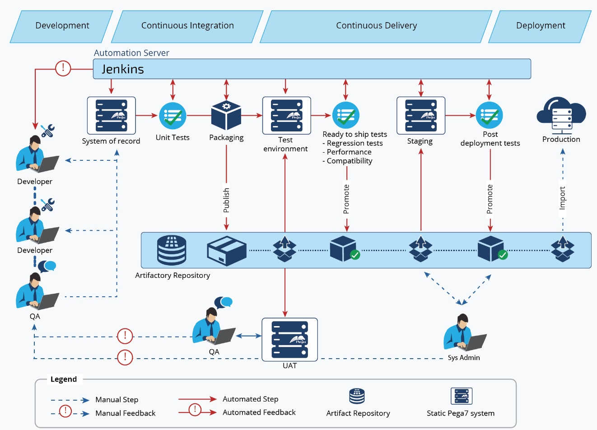

# Cloud-Ready Distributed Application Platform with Continuous Delivery Pipelines



## Overview

This project aims to build a highly scalable, automated, and containerized cloud application platform. The platform will serve as a foundation for developing, deploying, and managing distributed applications efficiently. It integrates CI/CD pipelines and supports best practices for continuous delivery and application security integration.

## Table of Contents
1. [Prerequisites](#prerequisites)
2. [Installation](#installation)
3. [Configuration](#configuration)
4. [Usage](#usage)
5. [Architecture](#architecture)
6. [Components](#components)
7. [CI/CD Integration](#cicd-integration)
8. [Security Integration](#security-integration)
9. [Mobile Application Integration](#mobile-application-integration)
10. [Contributing](#contributing)
11. [License](#license)

## Prerequisites

- Docker
- Kubernetes
- Jenkins
- Maven
- Git
- JDK 8 or above
- JBOSS EAP
- Rational Application Developer 8.x+, Intellij, or Eclipse
- IBM Security Identity Manager Suite
- Microsoft Active Directory
- Apple iOS development environment (optional for mobile integration)

## Installation

1. **Clone the Repository**
   ```sh
   git clone https://github.com/your-repository/cloud-app-platform.git
   cd cloud-app-platform
   ```
2. **Setup Docker and Kubernetes**
   - Ensure Docker is installed and running.
   - Setup a Kubernetes cluster (e.g., using Minikube for local development).
   
3. **Configure Jenkins**
   - Install Jenkins and required plugins (Git, Docker, Kubernetes, etc.).
   - Create Jenkins pipelines for CI/CD workflows.
   
4. **Build Application Components**
   ```sh
   mvn clean install
   ```

5. **Deploy JBOSS Infrastructure**
   - Deploy JBOSS EAP, Servlet containers, and ActiveMQ on Docker/Kubernetes.

## Configuration

- **Application Configuration**: Modify configuration files under `config/` directory to set up application-specific settings.

- **CI/CD Pipeline Configuration**: Configure Jenkins pipelines (`Jenkinsfile`, etc.) to set up automated builds, tests, and deployments.

- **Security Integration**: Configure connections to IBM Security Identity Manager Suite and Microsoft Active Directory in `security-config/`.

## Usage

1. **Starting the Platform**
   ```sh
   docker-compose up
   ``
2. **Accessing Services**
   - WebInterface: `http://localhost:8080`
   - API Services: `http://localhost:8081/api`

3. **Deploying Applications**
   ```sh
   kubectl apply -f deployment.yml
   ``
   Use provided `deployment.yml` templates to deploy applications.

4. **Monitoring and Logs**
   - Access Jenkins dashboard for logs: `http://localhost:8080/jenkins`
   - Use Kubernetes commands to monitor pods and services.
     ```sh
     kubectl get pods
     kubectl logs <pod-name>
     ```

## Architecture

This platform follows a microservices architecture, where each service runs in its own container. The architecture comprises:
- **Web Interface**: Web application front-end built using portal and web container architectures.
- **API Services**: Backend microservices accessed through RESTful APIs.
- **Messaging Layer**: Uses ActiveMQ for messaging between services.
- **CI/CD Layer**: Jenkins, Maven, and Git integrated for continuous delivery.
- **Security Layer**: Integration with IBM Security Identity Manager Suite and Microsoft Active Directory for authentication/authorization.

## Components

- **Web Interface**: Implements the UI/UX for interacting with the platform.
- **API Services**: Includes core business logic and application services.
- **Messaging Layer**: Facilitates communication between different microservices.
- **CI/CD Pipeline**: Automates build, test, and deploy stages.
- **Security Services**: Provides authentication and authorization mechanisms.

## CI/CD Integration

- **Jenkins Pipelines**:
   - `build`: Compiles code and runs unit tests.
   - `deploy`: Deploys built artifacts to Kubernetes.
   - `monitor`: Monitors deployment and health of services.

- **Maven**: Used for project build lifecycle management.
- **Git**: Version control system to manage source code and pipeline scripts.

## Security Integration

- **IBM Security Identity Manager Suite**: Manages user identities and access policies.
- **Microsoft Active Directory**: Centralized platform for managing user authentication and authorization.
- **Configuration**: Modify `security-config/` files for security integration setup.

## Mobile Application Integration

This platform includes optional support for developing and integrating mobile applications in an Apple iOS environment.
- **Setup**: Follow standard Xcode setup and integrate with API endpoints.
- **Build**: Use Xcode or command line tools to build the iOS application.
- **Deploy**: Deploy mobile application to Apple devices or simulators.

## Contributing

We welcome contributions from the community. Please read the [CONTRIBUTING.md](CONTRIBUTING.md) file for more information on how to get involved.

## License

This project is licensed under the MIT License. See the [LICENSE](LICENSE) file for details.
